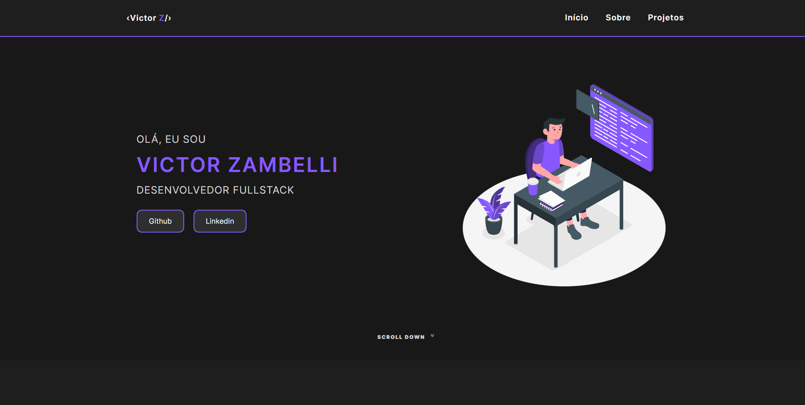

# portfolio
Projeto desenvolvido como meu repositório com meus projetos que já desenvolvi.

## 🚀 Tecnologias

Esse projeto foi desenvolvido com as seguintes tecnologias:
- HTML
- CSS
- Json
- JavaScript
- Git & Github

## 📚 Bibliotecas:
- [JavaScript](https://developer.mozilla.org/pt-BR/docs/Web/JavaScript)

## 💻 Projeto

[Clique aqui para acessar]()
> **Objetivo:** Criar um portfólio para guardar projetos desenvolvidos e falar um pouco sobre mim.
